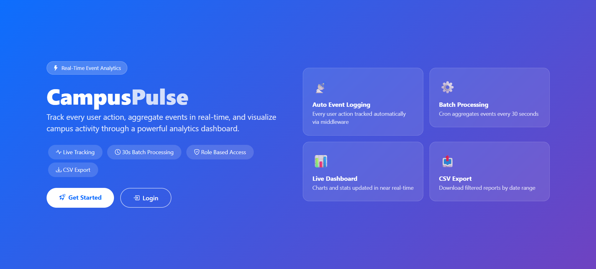
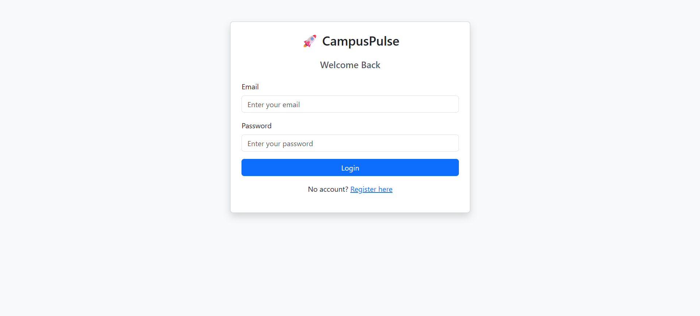
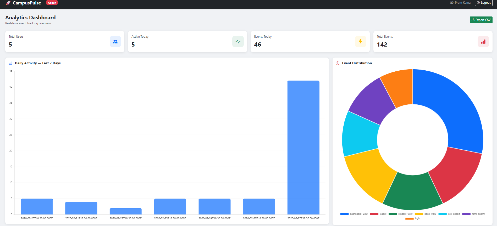
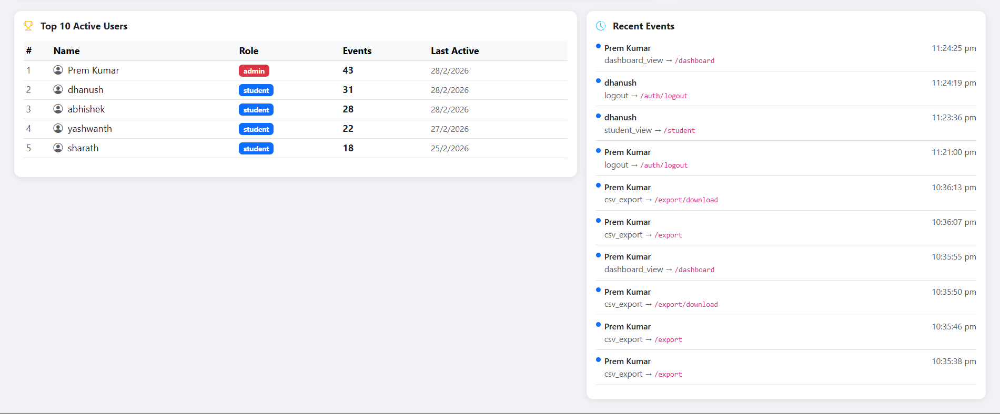
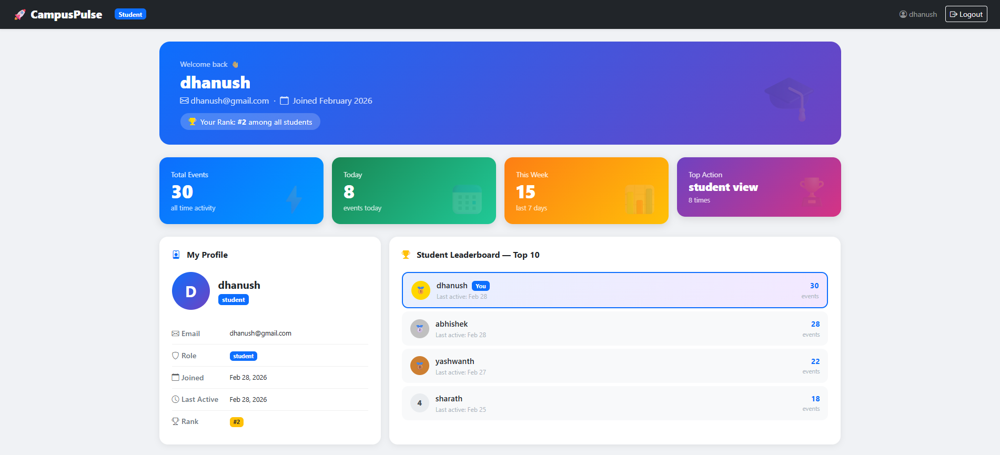

# 🚀 CampusPulse — Real-Time Event Analytics System

A full-stack event analytics system built with Node.js, Express, and MySQL.
Implements automatic event tracking, micro-batch aggregation, and a
real-time admin dashboard.

---

## 📸 Screenshots

### 🏠 Home Page

### 🔐 Login

### 📊 Admin Dashboard

### 👤 Student Dashboard

### 📤 CSV Export

---

## 🛠 Tech Stack

| Layer | Technology |
|---|---|
| Server | Node.js + Express |
| Database | MySQL |
| Templating | EJS |
| Styling | Bootstrap 5 |
| Charts | Chart.js |
| Auth | bcrypt + express-session |
| Scheduling | node-cron |
| Export | json2csv |

---

## ✨ Features

- 🔐 Register / Login with role-based access (Admin, Student)
- 📡 Automatic event logging on every user action
- ⚙️ Micro-batch processor runs every 30 seconds
- 📊 Admin analytics dashboard with Chart.js
- 👤 Student dashboard with leaderboard
- 📤 CSV export with date range filter

---

## 🗄 Database Schema

- `users` — authentication and roles
- `raw_events` — every user action logged here
- `event_summary` — aggregated counts by date + event type
- `user_engagement` — per-user lifetime activity stats

---

## ⚙️ Setup Instructions

### 1. Clone the repo
\`\`\`bash
git clone https://github.com/premkumar2005/campuspulse.git
cd campuspulse
\`\`\`

### 2. Install dependencies
\`\`\`bash
npm install
\`\`\`

### 3. Create MySQL database
\`\`\`bash
mysql -u root -p
\`\`\`
\`\`\`sql
CREATE DATABASE campuspulse;
\`\`\`

### 4. Run schema
\`\`\`bash
mysql -u root -p campuspulse < schema.sql
\`\`\`

### 5. Create .env file
\`\`\`env
DB_HOST=localhost
DB_PORT=3306
DB_NAME=campuspulse
DB_USER=root
DB_PASSWORD=your_password
SESSION_SECRET=your_secret_key
PORT=3000
\`\`\`

### 6. Start the app
\`\`\`bash
node app.js
\`\`\`

### 7. Open browser
\`\`\`
http://localhost:3000
\`\`\`

---

## 📁 Project Structure

\`\`\`
campuspulse/
├── app.js
├── schema.sql
├── seedEvents.js
├── cron/
│   └── aggregator.js
├── controllers/
│   ├── authController.js
│   ├── dashboardController.js
│   ├── exportController.js
│   └── studentController.js
├── db/
│   └── index.js
├── middleware/
│   ├── authMiddleware.js
│   ├── errorHandler.js
│   └── eventLogger.js
├── routes/
│   ├── auth.js
│   ├── dashboard.js
│   ├── export.js
│   ├── index.js
│   └── student.js
├── views/
│   ├── partials/
│   ├── auth/
│   ├── dashboard.ejs
│   ├── student.ejs
│   └── export.ejs
└── screenshots/
\`\`\`
